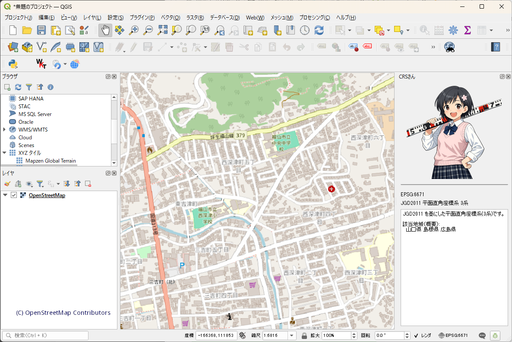

# CRS Companion / CRSさん

A QGIS plugin that shows a dockable panel for the current project CRS.

The panel displays, from top to bottom:

1. CRS character image
2. Horizontal resize handle
3. CRS code such as `EPSG:4326`
4. CRS name
5. CRS explanation text

CRS data and most plugin UI strings are stored in `crs_companion/crs_data/crs_companion.json`.
Images are stored in `crs_companion/images/`.

Initial supported CRS:

- EPSG:4326
- EPSG:4301
- EPSG:4612
- EPSG:6668
- EPSG:3395
- EPSG:3857
- EPSG:30161-30179
- EPSG:2443-2461
- EPSG:6669-6687
- EPSG:32651-32656
- EPSG:3092-3096
- EPSG:3097-3101
- EPSG:6688-6692

## Image resizing

The image width follows the dock panel width.
The image height is changed only by dragging the horizontal line handle below the image. Dragging on the image itself does not resize it.
The explanation text area absorbs the remaining dock space.

## Localization

The plugin is designed for `en` and `ja` from the start.

- English display name: `CRS Companion`
- Japanese display name: `CRSさん`

Most visible strings are externalized in the `ui` section of `crs_companion/crs_data/crs_companion.json`.
Translation source files are also included in `crs_companion/i18n/` for future Qt-based UI strings.
Compile `.ts` files to `.qm` with Qt Linguist tools in your QGIS/Qt environment if needed.

## Install

1. Download or clone this repository.
2. Create a ZIP file from the `crs_companion` folder. The ZIP file must contain `metadata.txt` at the top level.
    ```text
       crs_companion.zip
       ├── metadata.txt
       ├── __init__.py
       ├── crs_companion.py
       ├── crs_companion_config.py
       ├── crs_companion_dock.py
       ├── crs_data/
       ├── i18n/
       └── images/
    ```
3. Open QGIS.
4. Open Plugins → Manage and Install Plugins....
5. Select "Install from ZIP".
6. Choose the ZIP file created in step 2.
7. Click "Install Plugin".
8. After installation, open "Plugins" → "CRS Companion" → "Toggle CRS Companion".

The CRS Companion dock panel will appear on the right side of the QGIS window.

# How to use.

- Once installed, you'll see the icon .
- Click the icon to toggle the panel.
- You can dock / undock and resize the panel.

## License

This plugin source code is licensed under the BSD 2-Clause License.

Images included in this plugin are licensed under CC BY 4.0, unless otherwise noted.

## Demo


